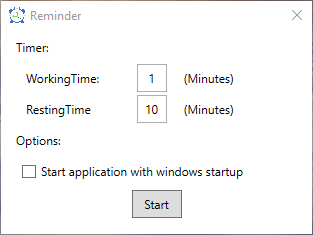
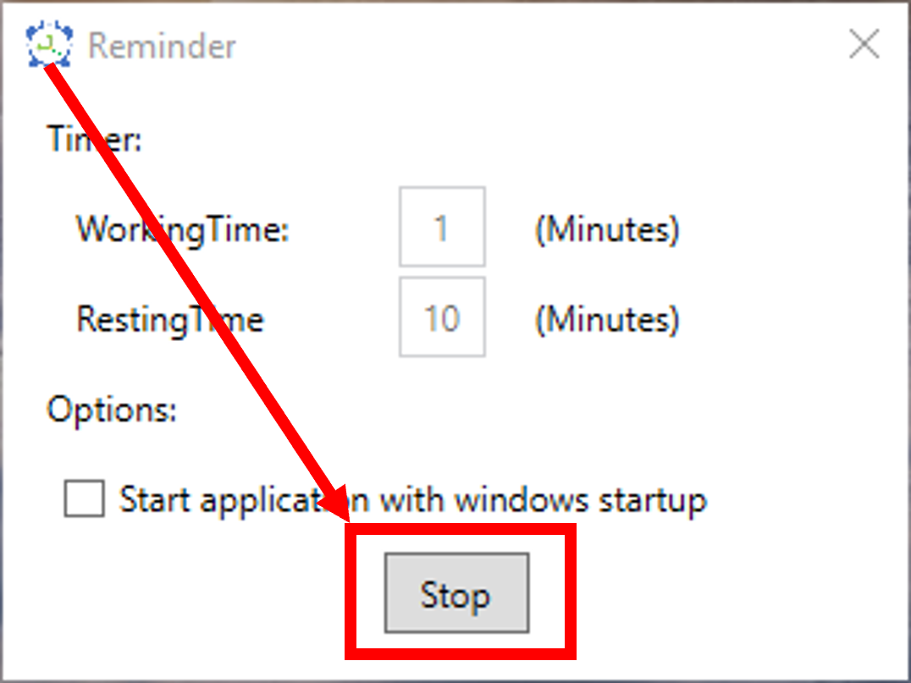
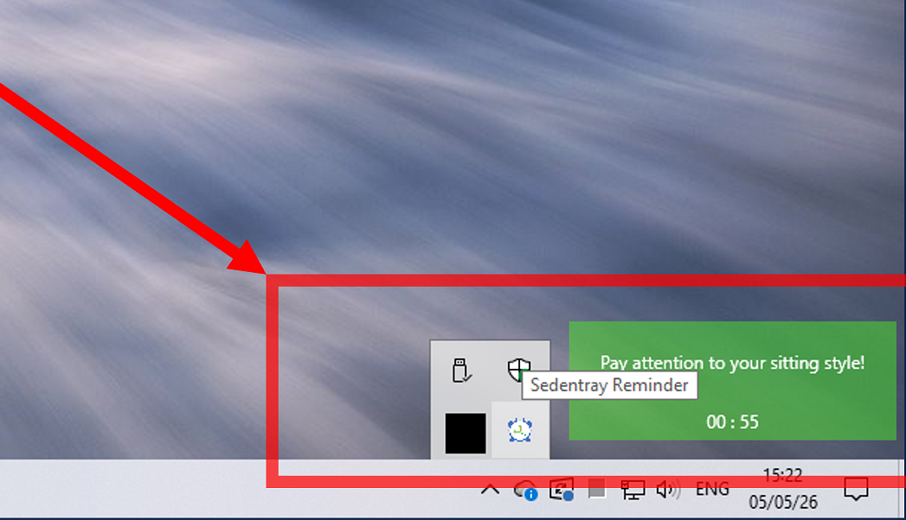
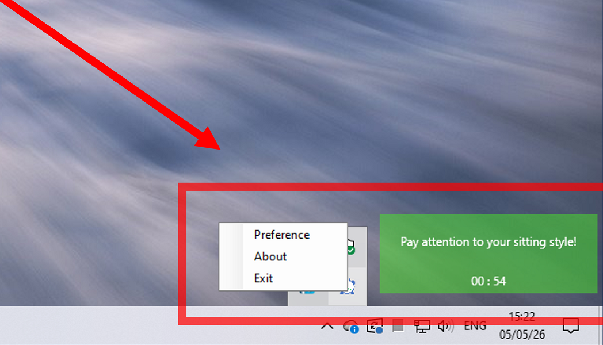
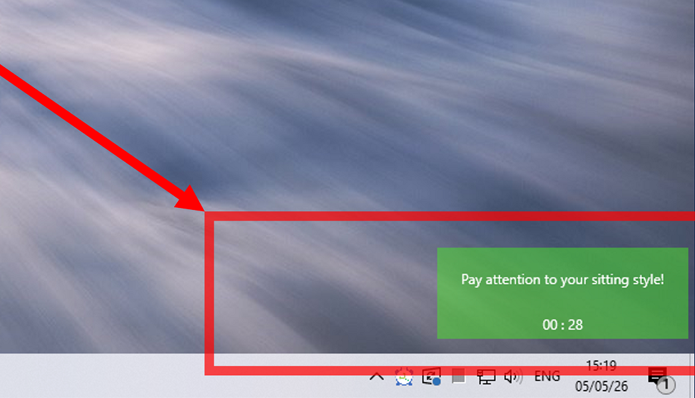
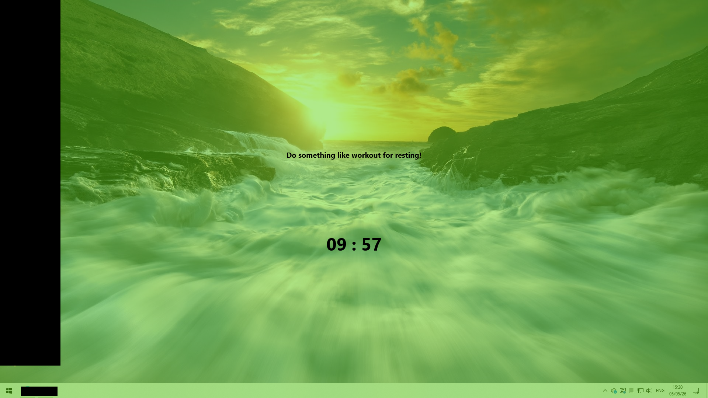

Pure DotNet Framework 8.0

Download the .net Framework 8.0

https://builds.dotnet.microsoft.com/dotnet/WindowsDesktop/8.0.26/windowsdesktop-runtime-8.0.26-win-x64.exe

Better for Freelance developer, work at home!

main ui：

click start button：

click stop button：

the icon in the right bottom of the taskbar：

right click the icon and the popup menu showed：

after click the start button：

rest ui：

